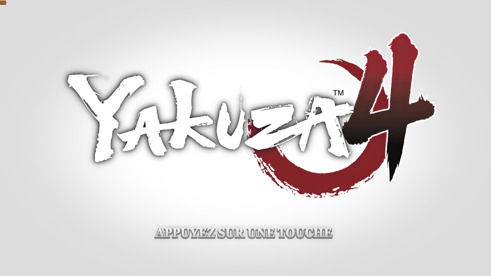
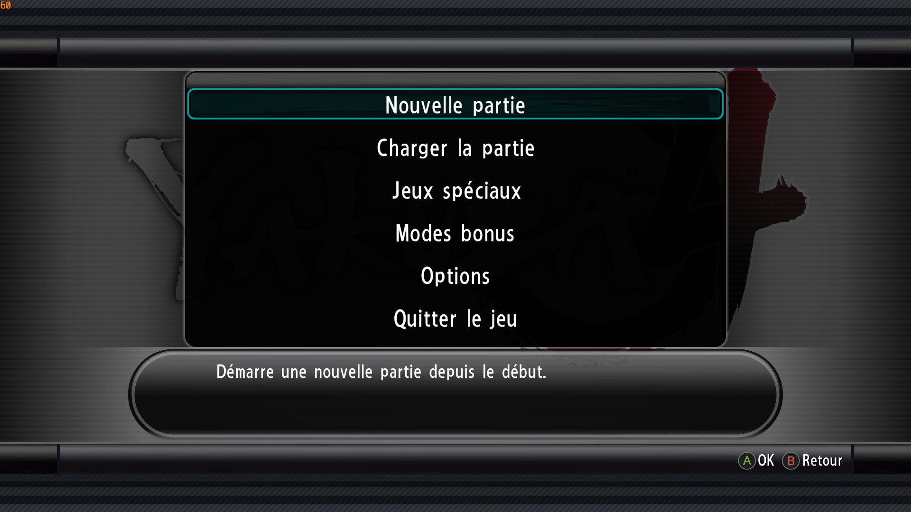
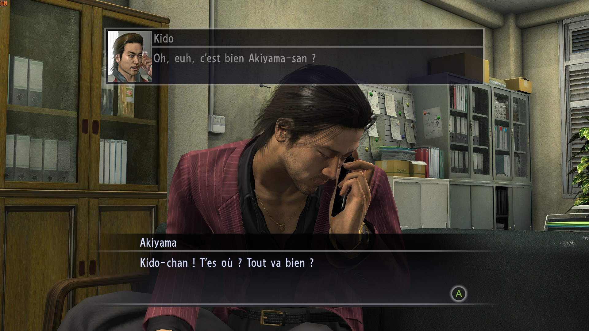
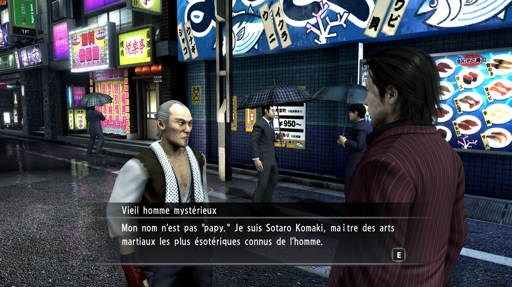
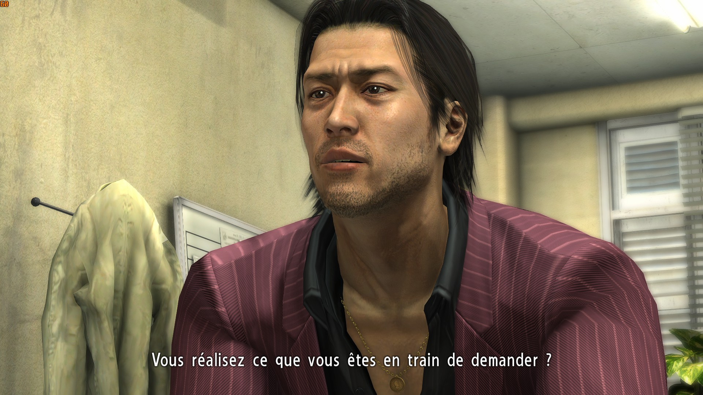
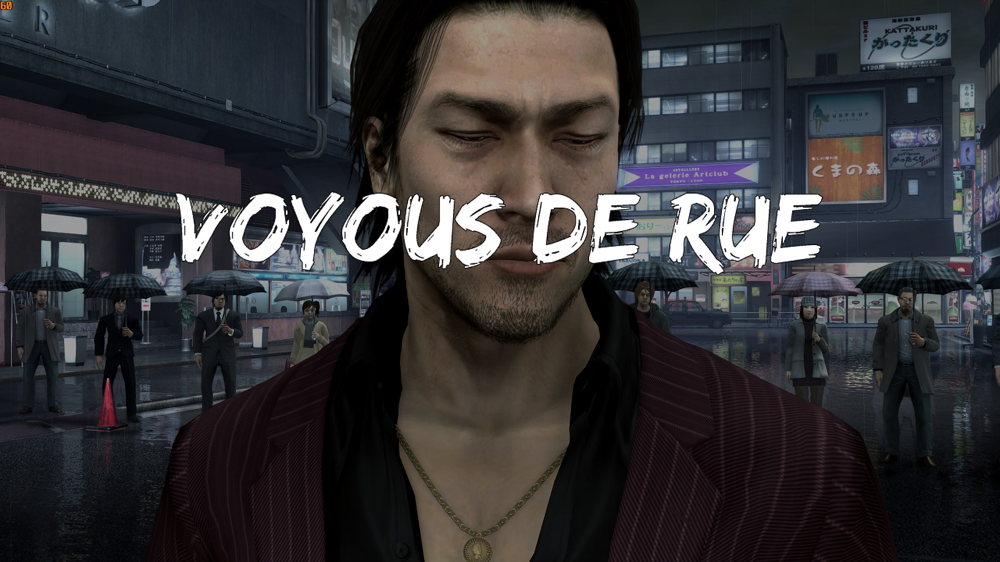
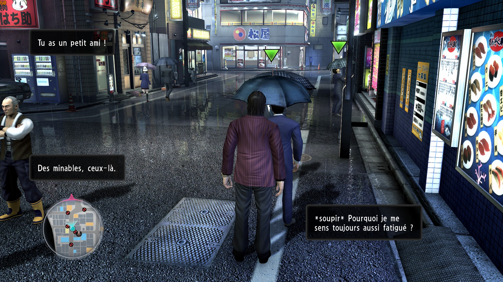

  

  
  

# Yakuza 4 Remastered — Patch français PC

> Patch français non officiel pour *Yakuza 4 Remastered* sur PC Steam :
> dialogues, sous-titres, menus, objectifs et interface en français.

**[Télécharger la dernière version](https://github.com/Egld-Rma/Yakuza4-Remastered-FR/releases/latest)**

## Sommaire

- [Le projet](#le-projet)
- [Aperçus](#aperçus)
- [Installation](#installation)
- [Contenu du patch](#contenu-du-patch)
- [État du projet](#état-du-projet)
- [Signaler un problème](#signaler-un-problème)
- [FAQ](#faq)
- [Roadmap](#roadmap)
- [Remerciements](#remerciements)

## Le projet

Ce projet propose une traduction française de *Yakuza 4 Remastered*. Il est
réalisé par **Egld-Rma** pour rendre cette partie de la série plus accessible
aux joueurs ayant découvert la licence avec *Yakuza Kiwami*, *Yakuza Kiwami 2*
et *Yakuza Kiwami 3 & Dark Ties*.

La traduction couvre les dialogues, sous-titres, menus, objectifs,
descriptions, messages d'ambiance et plusieurs éléments graphiques. Le travail
sur *Yakuza 4* servira aussi de base aux projets prévus sur *Yakuza 5* et
*Yakuza 6*.

## Aperçus

  
  

  
  

  
  

## Installation

1. Télécharge l'archive de la
   [dernière release](https://github.com/Egld-Rma/Yakuza4-Remastered-FR/releases/latest).

2. Ferme *Yakuza 4 Remastered*.

3. Accède au dossier d'installation du jeu.

4. Ouvre l'archive et glisse le dossier `data` dans le dossier du jeu.

5. Accepte le remplacement des fichiers.

Il n'y a aucun installateur à lancer. Pour revenir à la version d'origine,
utilise la vérification de l'intégrité des fichiers dans Steam.

> Télécharge l'archive depuis **Releases**. Le bouton
> **Code → Download ZIP** ne contient pas le patch installable.

### Compatibilité

La traduction est construite et testée sur Steam. Les versions GOG et Xbox app
/ Game Pass pourraient être compatibles si leur dossier `data` est identique,
mais elles ne sont pas encore testées officiellement.

## Contenu du patch

Le dossier `data` de la release contient uniquement les fichiers modifiés :

- **Interface et écrans** — `data/2d/`, `data/fontpar/` et `data/mvuen/`
- **Cinématiques et séquences** — `data/auth/` et `data/hact/`
- **Menus, objectifs et descriptions** — `data/bootpar/`, `data/pausepar/`,
  `data/ikusei/` et `data/db.soul/`
- **Courriers et mini-jeux** — `data/scenario_en/` et `data/minigame/`
- **Dialogues, boutiques et interactions** — `data/wdr_par_en/`

Liste technique complète des fichiers inclus

- `data/2d/cse_en.par`
- `data/2d/first_load_picture_en.par`
- `data/2d/sprite_en.par`
- `data/2d/tex_common_en.par`
- `data/auth/subtitle.par`
- `data/bootpar/boot_en.par`
- `data/db.soul/en/middle_file_reactive_obj_name.bin`
- `data/db.soul/en/msg.bin`
- `data/db.soul/en/msg_replacer.bin`
- `data/fontpar/font_hd_en.par`
- `data/hact/subtitle.par`
- `data/ikusei/ikusei_param_en.par`
- `data/minigame/chohan/bakuto_en.bin`
- `data/mvuen/CI_us.usm`
- `data/pausepar/pause_en.par`
- `data/scenario_en/mail.bin`
- `data/wdr_par_en/common.par`
- `data/wdr_par_en/wdr.par`

## État du projet

La traduction est jouable et fait encore l'objet d'une phase de débogage. La
version finale sera publiée après validation de l'histoire principale de bout
en bout sans blocage. Elle sera également proposée sur Nexus Mods.

Des erreurs de contexte, d'affichage, d'orthographe ou de formulation peuvent
encore subsister. Les retours de jeu permettent de les repérer et de les
corriger.

## Signaler un problème

Ouvre une [issue GitHub](https://github.com/Egld-Rma/Yakuza4-Remastered-FR/issues)
ou contacte-moi sur Discord : **egld**.

Pour qu'un signalement soit exploitable, indique :

- le chapitre ou l'endroit concerné ;
- ce qui s'affiche ou ce qui se produit ;
- une capture d'écran ou une vidéo si possible ;
- une sauvegarde si le problème dépend d'un chargement précis.

Les conseils, corrections de traduction et suggestions sont aussi les
bienvenus.

## FAQ

### Mes sauvegardes sont-elles compatibles ?

Le patch ne modifie pas les fichiers de sauvegarde.

### Comment désinstaller le patch ?

Sur Steam, utilise la vérification de l'intégrité des fichiers du jeu. Elle
restaurera les fichiers d'origine.

### Un texte est encore en anglais ou ne correspond pas à la scène.

Signale-le avec une capture et l'endroit exact. Les dialogues sont souvent
extraits hors contexte, ce qui peut mener à une mauvaise interprétation.

### Le patch fonctionne-t-il sur GOG ou Game Pass ?

La compatibilité est possible, mais non confirmée. Steam reste la plateforme de
référence pour les tests.

## Roadmap

1. Corriger les retours de la pré-bêta et les éventuels blocages.
2. Relire les textes et améliorer les formulations signalées.
3. Tester l'histoire principale de bout en bout.
4. Préparer la version finale et sa publication sur Nexus Mods.

## Remerciements

- [Byce61](https://www.youtube.com/@Byce61), dont le
  [let's play de *Yakuza 4 Remastered*](https://www.youtube.com/watch?v=wrGzgohh6nE&list=PLqIbGHNnXL8OAqlWcjmTunNXjs9ktXQIJ)
  a servi de référence pour le travail manuel sur les cinématiques.
- Les auteurs de la
  [traduction espagnole de *Yakuza 4 Remastered*](https://steamcommunity.com/sharedfiles/filedetails/?id=3620446326&l=spanish)
  et de [Yakuza 4 Patch ITA](https://github.com/zSavT/Yakuza4-Patch-ITA),
  pour les références techniques rendues publiques.
- Les projets open source
  [Lib20070319](https://github.com/Ret-HZ/Lib20070319) et
  [ParManager](https://github.com/Kaplas80/ParManager), utilisés pour mieux
  comprendre les archives du jeu.
